# Diploma thesis: Audio Separation Tool

A desktop application for separating audio files into vocals and instrumentals using AI-powered tools like Spleeter, Demucs, and OpenUnmix. It also supports transcription of vocals using OpenAI's Whisper model. Built with Python and CustomTkinter for a modern, dark-themed GUI.

## Features

*   **Audio Separation**: Separate songs into vocals and instrumentals using multiple AI tools:
    
    *   Spleeter
        
    *   Demucs (with models like mdx, mdx\_extra, htdemucs)
        
    *   OpenUnmix (with models like umxl, umxhq, umx, umxse)
        
*   **Output Formats**: Export in WAV, MP3, or FLAC with customizable settings (sample rate, bitrate, channels, bit depth).
    
*   **Transcription**: Optionally transcribe vocals to text using Whisper, with timestamps.
    
*   **File Management**: Browse and manage input/output folders, add songs, and open files directly.
    
*   **Progress Tracking**: Modal progress window with cancellation support.
    
*   **Cross-Platform**: Works on Windows, macOS, and Linux.
    

## Screenshots

### Input Tab

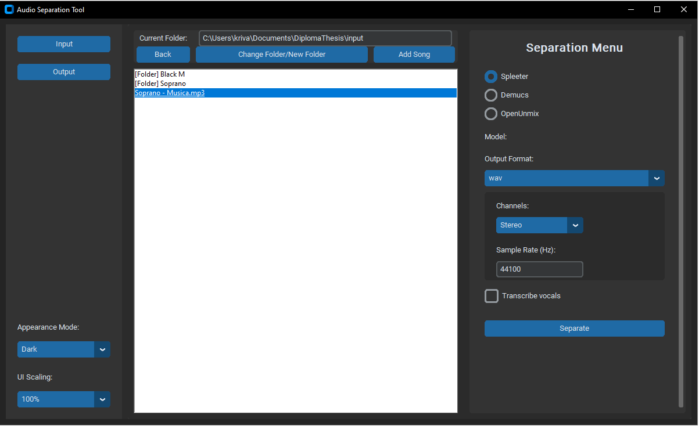

_The main interface showing the input tab with file browser and separation options._   
_User can use path_entry field to quickly change input folder._ 

### Separation settings for each AI-tool

_Separation options depends on AI-tool's capability ._

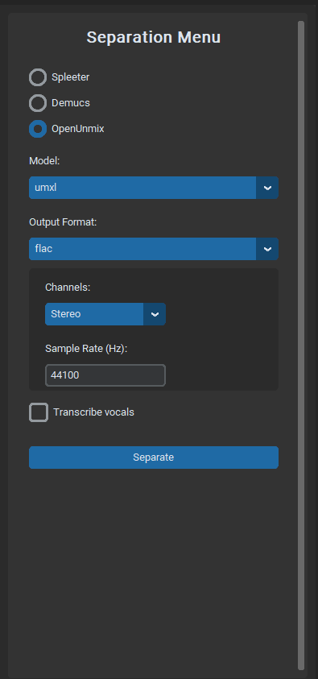
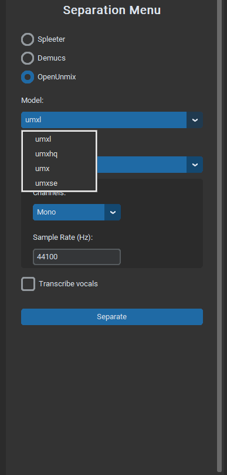
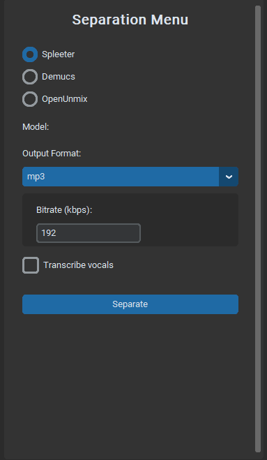

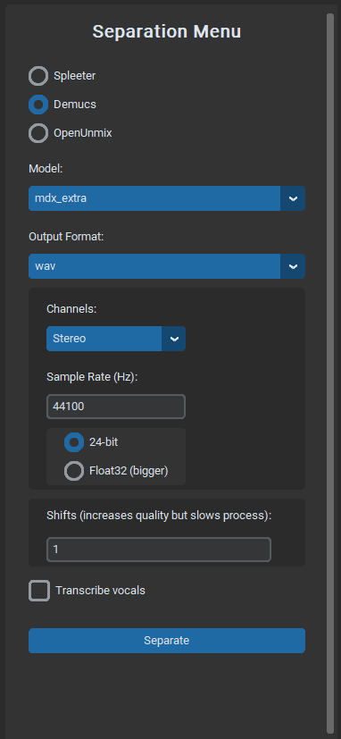
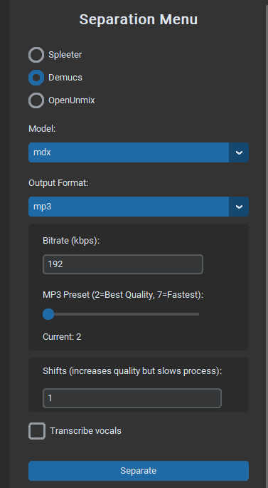
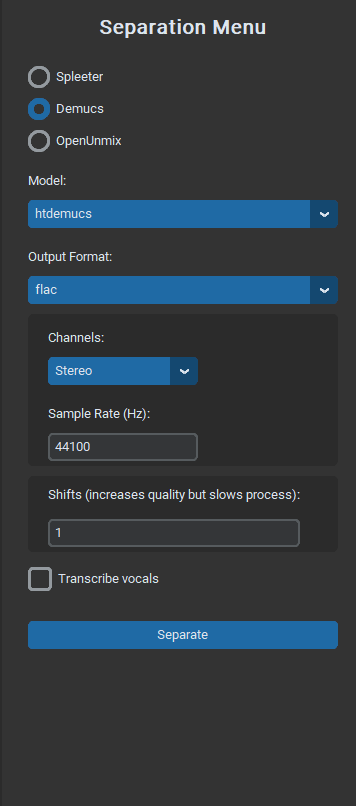

### Output Tab
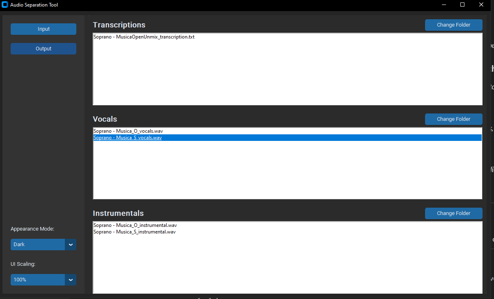

_View and manage separated vocals, instrumentals, and transcriptions._   
_Program automaticly adds number at the end if same file and same output format selected._

### Separation in Progress

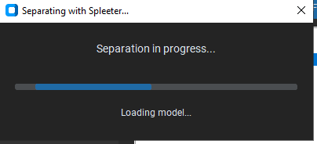

_Modal progress window during audio processing._

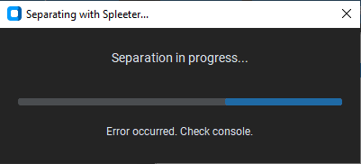

_Modal progress window after audio processing. WIP - autoclose or OK button (error handeling)_

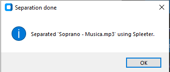

_Pop-up window after audio processing. WIP - integrate it to modal progress window_

## Installation

### Prerequisites

*   Visual Studio Code or some other python IDE

*   Python 3.9 or higher
    
*   FFmpeg (for audio processing; install via your package manager or from ffmpeg.org)  
 (For windows don't forget to add it to path in system variables using win+R and typing "sysdm.cpl")
    
### Clone the Repository

    clone https://github.com/krivanekroman76/DiplomaThesis.git

or download it in .zip file

### Create virtual enviroment for python

In Visual studio code make sure you have python extension and python icon on the left menu. In python menu in global environments at Venv select + icon and create a new .venv python distribution using python 3.9.   
Best place for .venv is in the projects fodler (workspace environments)

Activate virtual environment by typing "& " and full direction path of Activate.ps1 located in .venv folder to the terminal.    
it should look like:

     & C:/Users/kriva/Documents/DiplomaThesis/.venv/Scripts/.venv/Scripts/Activate.ps1

### Dependencies

Install the required Python packages:

    pip install -r requirements.txt

*   **CustomTkinter**: For the modern GUI.
    
*   **Whisper**: For transcription (from OpenAI).
    
*   **Spleeter, Demucs, OpenUnmix**: For audio separation. These may require additional setup (e.g., model downloads on first run).

### Run the Application

Then run code by pressing "Run Python File" (play button on the top) or typing command to run python.exe from .venv/Scripts (like Activate.ps1) via full direction path and placing separation_app.py full direction path after that, like:

    & C:/Users/kriva/Documents/DiplomaThesis/.venv/Scripts/python.exe c:/Users/kriva/Documents/DiplomaThesis/separation_app.py

On first run, the app will create default **input/**, **output/vocals/**, **output/instrumentals/**, and **output/text/** folders in the project directory.

## Usage

1.  **Add Songs**: Use the "Add Song" button or place audio files (.mp3, .wav, .flac) in the **input/** folder. Or you can change the **input folder** by typing its full direction path or by "Change Folder/New Folder" button.
    
2.  **Select a Song**: In the Input tab, select a song from the list.
    
3.  **Configure Separation**:
    
    *   Choose an AI tool (Spleeter, Demucs, OpenUnmix).
        
    *   Select model (if posible).
        
    *   Pick output format and adjust settings (e.g., sample rate for WAV/FLAC, bitrate for MP3).
        
    *   Enable transcription if desired.
        
4.  **Separate**: Click "Separate" to process. Monitor progress in the modal window.
    
5.  **View Outputs**: Switch to the Output tab to browse vocals, instrumentals, and transcriptions. Double-click to open files. You can change each output folder destination if desired.

### Tips

*   For best results, use high-quality audio files.
    
*   Cancel long processes via the progress window.
    

## TODO 

This project is actively developed. Planned features and fixes include:

*   \[ \] SDR evaluation of tools on provided dataset.

*   \[ \] Transcription and Demucs tool repair.
    
*   \[ \] Add support for batch processing multiple songs at once.
    
*   \[ \] Implement transcription options (second choice).
    
*   \[ \] Improve error handling and logging for separation failures.
    
*   \[ \] Optimize performance for large files (e.g., GPU acceleration for Whisper/Separation).
    
*   \[ \] Cross-platform testing and packaging (e.g., via PyInstaller).
    
*   \[ \] Documentation: Add more detailed guides and API references for custom separators. Proper credits for used libraries.

Feel free to contribute or suggest features via issues!

## Contributing

Contributions are welcome! Please fork the repo, create a feature branch, and submit a pull request. For major changes, open an issue first to discuss.

### Development Setup

*   Ensure all dependencies are installed.
    
*   Run tests (if any) and check for linting with tools like **flake8**.
    
*   Follow PEP 8 style guidelines.
    

## License

This project is licensed under the MIT License - see the LICENSE file for details.

## Credits

*   **Libraries Used**:
    
    *   CustomTkinter for the GUI.
        
    *   OpenAI Whisper for transcription.
        
    *   Spleeter, Demucs, OpenUnmix for audio separation.
        
*   Inspired by various open-source audio processing tools.

## Support

If you encounter issues, check the console output for errors or open a GitHub issue. For questions, reach out via \[ 240642@vut.cz \].