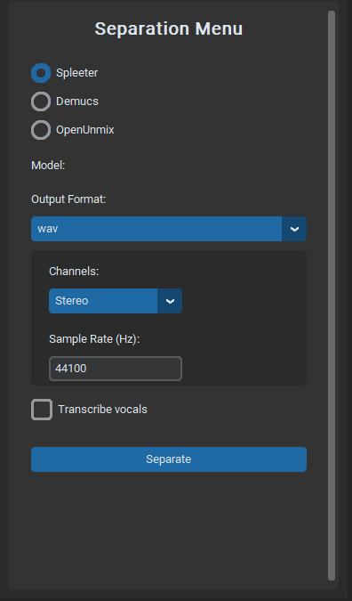
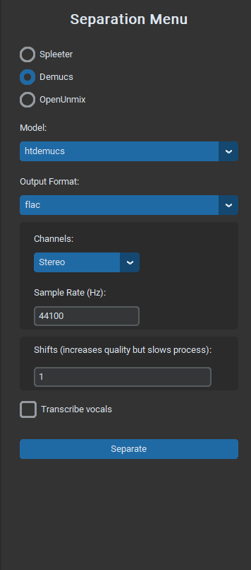
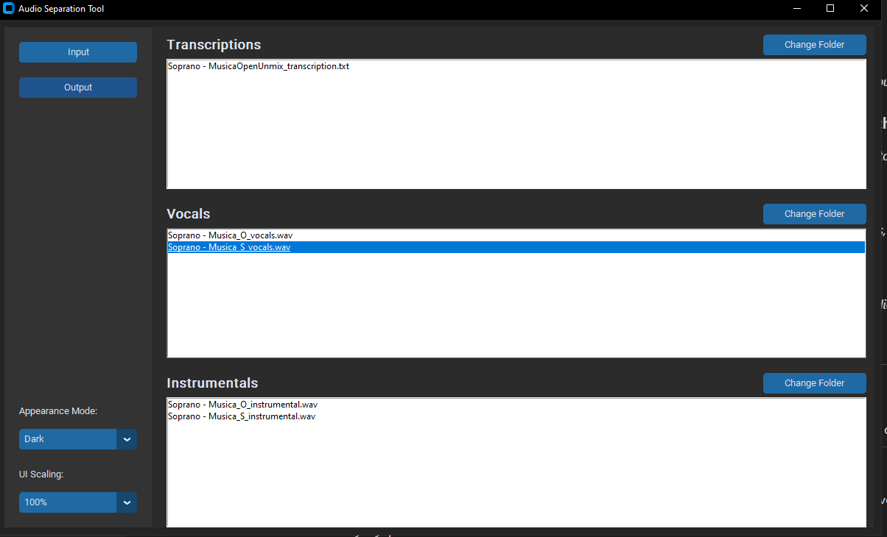

# Diploma thesis: Audio Separation Tool

A desktop application for separating audio files into vocals and instrumentals using AI-powered tools like Spleeter, Demucs, and OpenUnmix. It also supports transcription of vocals using OpenAI's Whisper model. Built with Python and CustomTkinter for a modern, dark-themed GUI.

## Features

*   **Audio Separation**: Separate songs into vocals and instrumentals using multiple AI tools:
    
    *   Spleeter
        
    *   Demucs (with models like mdx, mdx\_extra, htdemucs)
        
    *   OpenUnmix (with models like umxl, umxhq, umx, umxse)
        
*   **Output Formats**: Export in WAV, MP3, or FLAC with customizable settings (sample rate, bitrate, channels, bit depth).
    
*   **Transcription**: Optionally transcribe vocals to text using Whisper, with timestamps.
    
*   **File Management**: Browse and manage input/output folders, add songs, and open files directly.
    
*   **Progress Tracking**: Modal progress window with cancellation support.
    
*   **Cross-Platform**: Works on Windows, macOS, and Linux.
    

## Screenshots

### Input Tab

_The main interface showing the input tab with file browser and separation options._   
_User can use path_entry field to quickly change input folder._ 

### Separation settings for each AI-tool

_Separation options depends on AI-tool's capability ._

### Output Tab

_View and manage separated vocals, instrumentals, and transcriptions._   
_Program automaticly adds number at the end if same file and same output format selected._

### Separation in Progress

_Modal progress window during audio processing._

_Modal progress window after audio processing. WIP - autoclose or OK button (error handeling)_

## Installation

### Prerequisites

Follow these steps to set up the Audio Separation Tool on your system. This guide supports **Windows**, **macOS**, and **Linux**. Ensure you have administrative privileges if needed (e.g., for installing system dependencies).

### Prerequisites

- **Python 3.9 or higher**: Download from [python.org](https://www.python.org/downloads/). Verify with `python --version` or `python3 --version` in your terminal/command prompt.
- **FFmpeg**: Required for audio processing. 
  - **Windows**: Download from [ffmpeg.org](https://ffmpeg.org/download.html) (get the static build). Extract to a folder (e.g., `C:\ffmpeg`) and add `C:\ffmpeg\bin` to your system's PATH (search for "Environment Variables" in Windows search, edit PATH under System Variables).
  - **macOS**: Install via Homebrew: `brew install ffmpeg`. If Homebrew isn't installed, get it from [brew.sh](https://brew.sh).
  - **Linux**: Use your package manager: `sudo apt install ffmpeg` (Ubuntu/Debian) or `sudo dnf install ffmpeg` (Fedora). Verify with `ffmpeg -version`.
- **IDE (Optional but Recommended)**: Visual Studio Code (VS Code) for editing and running Python. Download from [code.visualstudio.com](https://code.visualstudio.com/). Install the Python extension for better support.

**NOTE**: If using IDE (VS Code) follow setup for **PowerShell** when on Windows in built in terminal. 

- **Git**: For cloning the repository. Download from [git-scm.com](https://git-scm.com/downloads) if not installed. Verify with `git --version`.

**NOTE**: You can download the code from this repository in .zip format at the top in green drop down menu `<> Code`, then extract it to your desired location. You can do this to skip **Git** dependencies if you want to test this out. If you download it follow only points 1 and 4 in next step. Hint: `cd <path>`

### Clone the Repository
1. Open a terminal/command prompt:
   - **Windows**: Command Prompt or PowerShell.
   - **macOS/Linux**: Terminal.

2. Navigate to a directory where you want to store the project (e.g., `cd Desktop`).

3. Clone the repository: https://github.com/krivanekroman76/DiplomaThesis.git

4. Enter the project folder: `cd DiplomaThesis`

### Set Up Virtual Environment

A virtual environment isolates dependencies. Create and activate it as follows (replace `<path>` with your actual path if needed).

1. **Create the Virtual Environment**:
    - **Windows (Command Prompt)**: `python -m venv .venv`
    - **Windows (PowerShell)**: `python -m venv .venv`
    - **macOS/Linux**: `python3 -m venv .venv`

**Note**: This should be done in folder from previus step to make project consistent.

2. **Activate the Virtual Environment**:
    - **Windows (Command Prompt)**: `.venv\Scripts\activate`
    - **Windows (PowerShell)**: `.venv\Scripts\Activate.ps1` 
    (If execution policy blocks it, run `Set-ExecutionPolicy -ExecutionPolicy RemoteSigned -Scope CurrentUser` first.)
    - **macOS/Linux**: `source .venv/bin/activate`

You should see `(.venv)` in your prompt. If not, ensure Python is correctly installed.

3. **Deactivate Later** (when done): Run `deactivate`.

**Note**: Always activate the virtual environment before installing dependencies or running the app.

### Install Dependencies

1. Ensure the virtual environment is activated (see above).

2. Install the required packages: `pip install -r requirements.txt`

This installs CustomTkinter, Whisper, Spleeter, Demucs, OpenUnmix, and other libraries. First run may download AI models (takes time and internet).

**Troubleshooting**:
- If `pip` fails, upgrade it: `python -m pip install --upgrade pip`.
- On Windows, if you get permission errors, run Command Prompt as Administrator.
- For GPU acceleration (optional, for faster processing), install CUDA-compatible versions if you have an NVIDIA GPU (check library docs for Spleeter/Demucs).

### Run the Application

1. Ensure the virtual environment is activated, dependecies are installed and you're in the project folder (`cd DiplomaThesis`).

2. Run the app:
    - **Windows**: `python separation_app.py`
    - **macOS/Linux**: `python3 separation_app.py`

The GUI should open. On first run, default folders (`input/`, `output/vocals/`, etc.) are created in the project directory.

**Troubleshooting**:
- If you get "Module not found" errors, ensure dependencies are installed in the active virtual environment.
- For GUI issues on Linux, install Tkinter: `sudo apt install python3-tk` (Ubuntu/Debian).
- Close the app with Ctrl+C in the terminal if it hangs.
- If FFmpeg isn't found, verify it's in PATH (run `ffmpeg -version` in a new terminal).

### Post-Installation Notes

- **First Run**: AI models download automatically—be patient.
- **Uninstall**: Delete the project folder and virtual environment.
- **Support**: If issues arise, check console output and refer to library docs (e.g., [Spleeter](https://github.com/deezer/spleeter), [Demucs](https://github.com/facebookresearch/demucs)).

## Usage

1.  **Add Songs**: Use the `Add Song` button or place audio files (.mp3, .wav, .flac) in the `input/` folder. Or you can change the `input folder` by typing its full direction path or by `Change Folder/New Folder` button.
    
2.  **Select a Song**: In the Input tab, select a song from the list.
    
3.  **Configure Separation**:
    
    *   Choose an AI tool (Spleeter, Demucs, OpenUnmix).
        
    *   Select model (if posible).
        
    *   Pick output format and adjust settings (e.g., sample rate for WAV/FLAC, bitrate for MP3).
        
    *   Enable transcription if desired.
        
4.  **Separate**: Click `Separate` to process.
    
5.  **View Outputs**: Switch to the `Output tab` to browse vocals, instrumentals, and transcriptions. Double-click to open files. You can change each output folder destination in output or settings tab if desired.

### Tips

*   For best results, use high-quality audio files.
    
*   Cancel long processes via the progress window.
    

## TODO 

This project is actively developed. Planned features and fixes include:

*   \[ \] SDR evaluation of tools on provided dataset.

*   \[ \] Transcription tool repair.
    
*   \[ \] Add support for batch processing multiple songs at once.
    
*   \[ \] Implement transcription options (second choice).
    
*   \[ \] Improve error handling and logging for separation failures.
    
*   \[ \] Optimize performance for large files (e.g., GPU acceleration for Whisper/Separation).
    
*   \[ \] Cross-platform testing and packaging (e.g., via PyInstaller).
    
*   \[ \] Documentation: Add more detailed guides and API references for custom separators. Proper credits for used libraries.

Feel free to suggest features via issues!

## License

This project is licensed under the MIT License - see the LICENSE file for details.

## Credits

*   **Libraries Used**:
    
    *   CustomTkinter for the GUI.
        
    *   OpenAI Whisper for transcription.
        
    *   Spleeter, Demucs, OpenUnmix for audio separation.
        
*   Inspired by various open-source audio processing tools.

## Support

If you encounter issues, check the console output for errors or open a GitHub issue. For questions, reach out via \[ 240642@vut.cz \].

