# Diploma thesis: Audio Separation & Transcription Tool

A desktop application for separating audio files into vocals and instrumentals using AI-powered tools (Spleeter, Demucs, and OpenUnmix). Furthermore, it supports advanced speech-to-text transcription using multiple tools (Whisper, Wav2Vec2, Vosk) with speaker diarization support (Vosk). Built with Python and CustomTkinter for a modern GUI.

## Features

### 🎵 Core Audio Processing
* **Audio Separation**: Isolate vocals and instrumentals using top-tier AI models:
  * **Spleeter**
  * **Demucs** (supports mdx, mdx_extra, htdemucs)
  * **OpenUnmix** (supports umxl, umxhq, umx, umxse)
* **Advanced Transcription**: Transcribe extracted vocals to text with timestamps using:
  * **OpenAI Whisper** (Highly accurate, multi-language)
  * **Wav2Vec2** (Fast, HuggingFace integration)
  * **Vosk** (Lightweight, supports **Speaker Diarization** to identify different singers/speakers)
* **Flexible Output Formatting**: Export in WAV, MP3, or FLAC with granular control over sample rate, bitrate, channels (Mono/Stereo), and bit depth.

### ⚙️ System & Performance
* **Hardware Acceleration Control**: Explicitly assign tasks to the CPU or GPU (CUDA/MPS) directly from the UI, or let the app auto-detect the best hardware.
* **Smart Memory Management**: Implements aggressive garbage collection (RAM/VRAM flushing) between processing chunks and batch files to prevent memory leaks and crashes on lower-end hardware.
* **Asynchronous Processing**: Heavy AI tasks are offloaded to background daemon threads, keeping the main GUI completely responsive.

### 🖥️ User Experience & Workflow
* **Batch Processing**: Queue up and run standalone batch transcriptions on multiple selected vocal or instrumental tracks simultaneously.
* **Offline First**: Designed to work entirely offline once models are acquired. The app automatically scans local directories for manually downloaded models (like Vosk) and avoids unnecessary network calls.
* **Interactive GUI**: Built with CustomTkinter for a modern interface featuring a Welcome Screen, detailed file information viewing, and one-click file opening.
* **Real-time Progress Tracking**: Modal progress window with detailed step-by-step logging, error catching, and safe cancellation support.
* **Cross-Platform Compatibility**: Works natively on Windows, macOS, and Linux.

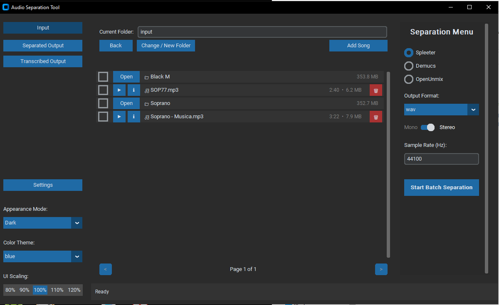

## Installation

Choose the installation method that best fits your needs. The pre-packaged Windows release is highly recommended for standard users.

### Method 1: Portable Windows Release (Easiest)
No Python or prerequisite installations required. This is a standalone version.
* **Step 1:** Download the latest `AudioSeparatorApp.rar` from the [Releases page]([text](https://github.com/krivanekroman76/DiplomaThesis/releases/tag/v0.9.1)).
* **Step 2:** Extract the archive using WinRAR or 7-Zip to your desired location.
* **Step 3:** Open the extracted folder and double-click the executable to launch the app.

---

### Method 2: Windows Batch Script (Automated Source Setup)
If you downloaded the source code (`.zip` or via Git) on Windows, you can use the included batch script to automate the environment setup.
* **Step 1:** Ensure you have [Python 3.9.x](https://www.python.org/downloads/) installed.
* **Step 2:** Download the repository and extract it.
* **Step 3:** Double-click the `windows.bat` file. This script will automatically create a virtual environment, install dependencies, and launch the application.

---

### Method 3: Manual Developer Setup (Cross-Platform / IDE)
For macOS, Linux, or developers who want to run the application manually via terminal or VS Code.

**1. Prerequisites**
* **Python 3.9.x**: Verify by running `python --version` in your terminal.  
    * (Windows 10 tested on 3.9.13 and macos tested on 3.9.25)
* **Git** (Optional): For cloning the repository. Alternatively, download the code as a `.zip` via the `<> Code` button. (part of Visual Studio Code IDE)

**2. Clone and Prepare**
* Open your terminal or IDE (like VS Code).
* Clone the repository: `git clone https://github.com/krivanekroman76/DiplomaThesis.git`
* Navigate to the folder: `cd DiplomaThesis`

**3. Virtual Environment & Dependencies**
* Create a virtual environment: `python -m venv .venv` (use `python3` on macOS/Linux).
* Activate it (Windows Command Prompt): `.venv\Scripts\activate`
* Activate it (Windows PowerShell): `.venv\Scripts\Activate.ps1`
* Activate it (macOS/Linux): `source .venv/bin/activate`
* Install requirements: `pip install -r requirements.txt`

**4. Run the Application**
* Execute the main script: `python separation_app.py`

---

### 📥 Offline Usage & Downloading Models
If you plan to use the application without an internet connection, you need to prepare the AI models beforehand:

* **Whisper, Demucs, and OpenUnmix:** These tools download their weights automatically the first time you use them. To prepare them for offline use, simply click the **Download Default Models** button in the Settings tab to cache them in advance.
* **Vosk:** Unlike the others, Vosk requires manual model downloading and placement for offline transcription:
  1. Go to the [Vosk Models Page](https://alphacephei.com/vosk/models).
  2. Download your preferred language models (e.g., `vosk-model-en-us-0.22`).
  3. Download `vosk-model-spk-0.4` if you want Speaker Diarization features.
  4. Extract the `.zip` files into the `Models/vosk/` directory inside your project folder. Ensure the core files (`am`, `conf`, `graph`) are directly inside the named folder without double-nesting.
  5. In the app's Settings tab, add the exact folder names to the Vosk entry field separated by commas, or simply click the **Scan Directory** button to add them automatically.

---

### Troubleshooting
* **FFmpeg Issues:** For Windows users, `ffmpeg.exe` is already included in the repository folder. If you encounter audio processing errors, you may need to update this executable by downloading a fresh static build from [ffmpeg.org](https://ffmpeg.org/download.html) and replacing the one in the folder. Older versions of this repository code may require adding FFmpeg manually to your system's PATH.
* **Module Not Found:** Ensure your virtual environment is activated before running `pip install` or starting the app. Start only the `separation_app.py`for the GUI.
* **Linux GUI Errors:** You may need to install Tkinter. Run `sudo apt install python3-tk` (Ubuntu/Debian).

---

## Usage

1. **Add Songs:** Click the **Add Song** button or drag audio files (.mp3, .wav, .flac) into your designated `input/` folder. You can change your input directory directly in the UI.
2. **Manage & Select Files:** In the **Input** tab, check the boxes next to the songs or folders you want to process. Each audio file features a control panel where you can **Play**, view **Information**, check **Duration** and **Size**, or **Delete** the file.
3. **Configure Separation:** * Choose your preferred AI tool (Spleeter, Demucs, OpenUnmix).
   * Select a specific model from the dropdown (if applicable).
   * Adjust output formatting (Format, Sample Rate, Bitrate, Mono/Stereo). 
     * *Hint:* Audio formatting details can be copied directly from the input song's Information panel.
4. **Separate Audio:** Click **Start Batch Separation**. You can cancel long processes at any time via the Abort button on the progress bar.
5. **View Separation Outputs:** Navigate to the **Separation Output** tab to browse your generated vocals and instrumentals. Just like the input tab, use the inline buttons to play, view info, or delete files. Default output locations can be customized in the Settings tab.
6. **Transcribe Audio:** * Select the audio files you want to transcribe using their checkboxes.
   * Choose a transcription tool and its specific model.
   * Click **Transcribe**.
7. **View Transcription Outputs:** Navigate to the **Transcription Output** tab to browse your generated texts. Text files feature simplified inline controls allowing you to easily **Open**, view **Size**, and **Delete** them.

### Quick Tips
* **Interactive Tutorial:** Need a refresher on how to navigate the app? Go to the **Settings** tab and click **Show Tutorial** to view the welcome screen and UI highlights at any time!
* **Input Quality:** Always use high-quality, lossless audio files (WAV/FLAC) as inputs for the cleanest separation and transcription results.
* **First-Time Setup:** The first time you run a specific AI model, it will take extra time to download the necessary weights. Please be patient!

💡 Tip for Non-NVIDIA / CPU-Only Users (Save Download Size)
By default, the `requirements.txt` file is configured to download the CUDA-enabled (GPU) version of PyTorch, which provides massive speed boosts but is quite large (over 2 GB). If you do not have an NVIDIA graphics card, the app will still work perfectly on your CPU, but you can skip the large download.

Before running `pip install -r requirements.txt`, open the text file and **delete this line at the very top:**
`--extra-index-url https://download.pytorch.org/whl/cu118`

This will tell `pip` to download the standard CPU version of PyTorch instead, saving you a significant amount of time and disk space!

## 📸 Screenshots & Features

### Welcome Tutorial Screen
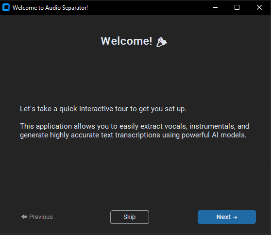

*A built-in interactive Welcome Tutorial highlights key UI elements to help new users get started instantly.*

### Main Interface (Input & Separation Menu)

*The modern interface featuring the Input tab. Manage files with interactive inline controls (Play, Info, Delete) and configure your output using the dynamic Separation Menu.*

### Audio Inspector
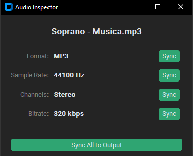

*Clicking the 'i' (Information) button on any track opens the Audio Inspector. Easily view track metadata and use the "Sync" buttons to match your output settings to the original file perfectly.*

### Dynamic Separation Settings
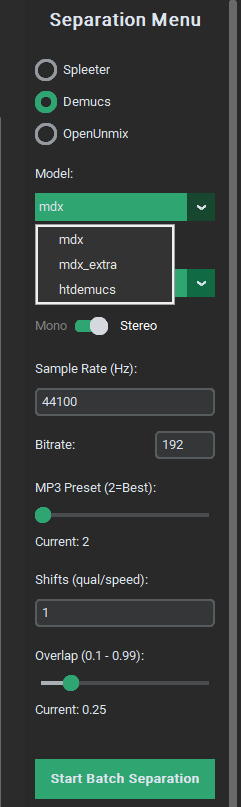 
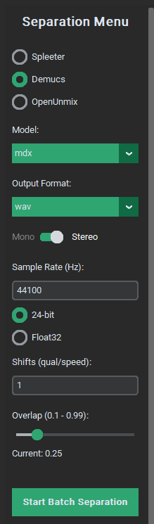 
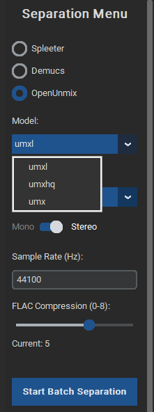
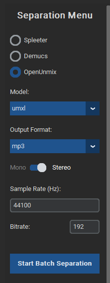 

*The Separation Menu adapts based on the selected AI tool (Spleeter, Demucs, OpenUnmix), offering granular control over formats (MP3, WAV, FLAC), bitrates, shifts, and specific model selection.*

### Output Management & Transcription
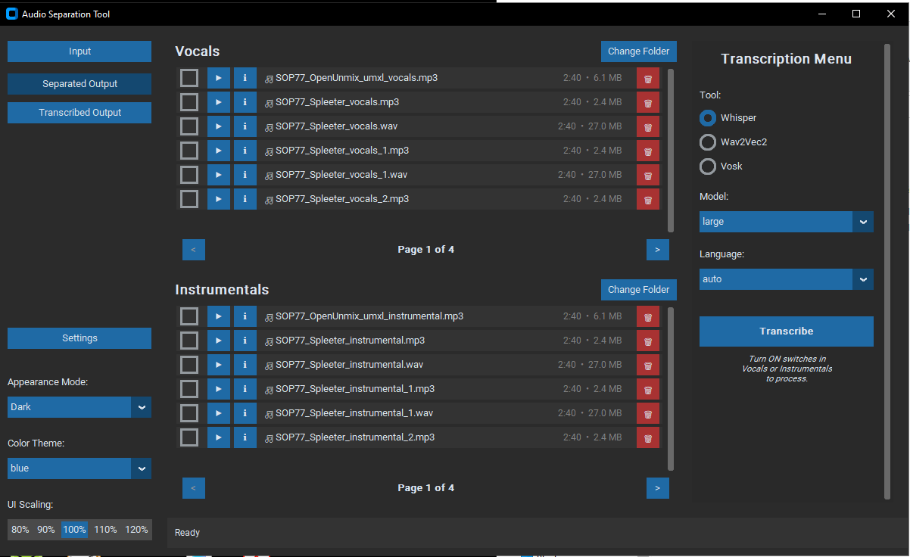

*The Separated Output tab neatly organizes generated Vocals and Instrumentals. Select isolated tracks here and use the right-hand Transcription Menu (Whisper, Wav2Vec2, Vosk) to generate text.*

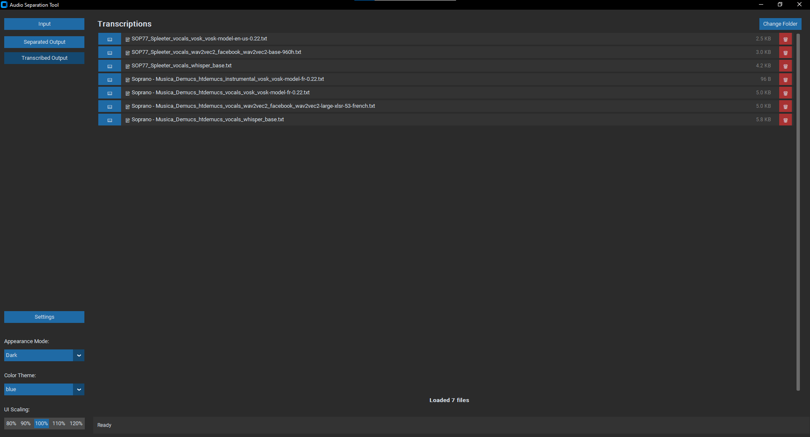

*A dedicated tab for managing, viewing, and opening your generated transcriptions.*

### App Settings
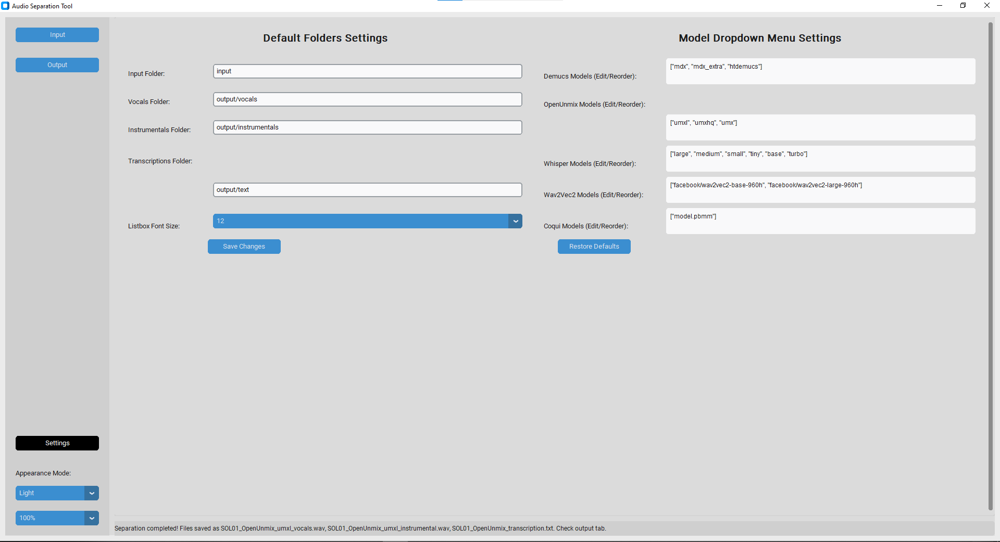

*Customize your experience: toggle Dark/Light mode, change the UI color theme, adjust scaling, and manage default directories or offline AI models.*

### Real-Time Progress
  
  
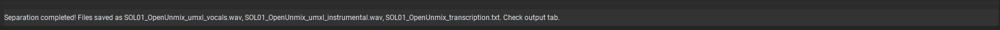  

*Keep track of heavy AI processing with real-time status updates, modal windows, and progress bars directly at the bottom of the window.*

### Completion Window
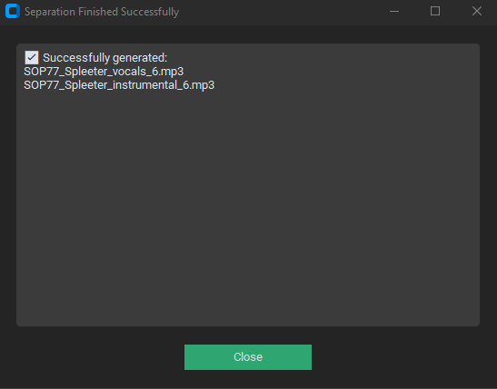 
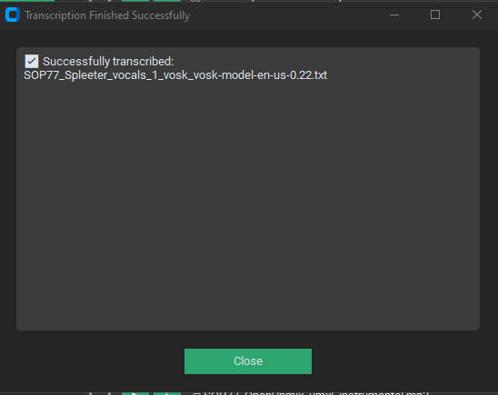

*Non-blocking pop-up windows informing the user of the names of the output files and the success count.*

## TODO 

This project is actively developed. Planned features and fixes include:

* [ ] SDR evaluation of tools on provided dataset.
* [x] Transcription tool repair.
* [x] Add support for batch processing multiple songs at once.
* [x] Implement transcription options (second choice: Vosk, Wav2Vec2).
* [x] Improve error handling and logging for separation failures.
* [ ] Optimize performance for large files (e.g., GPU acceleration for Whisper/Separation).
* [ ] Cross-platform testing and packaging (e.g., via PyInstaller).
* [ ] Documentation: Add more detailed guides and API references for custom separators. Proper credits for used libraries.

Feel free to suggest features via issues!

## License

This project is licensed under the MIT License - see the LICENSE file for details.

## Credits

*   **Libraries Used**:
    
    *   CustomTkinter for the GUI.
        
    *   OpenAI Whisper, Wav2vec2 from Hugging face, Vosk for transcription.
        
    *   Spleeter, Demucs, OpenUnmix for audio separation.
        
*   Inspired by various open-source audio processing tools.

## Support

If you encounter issues, check the console output for errors or open a GitHub issue. For questions, reach out via \[ 240642@vut.cz \].

